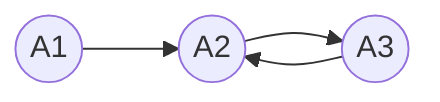
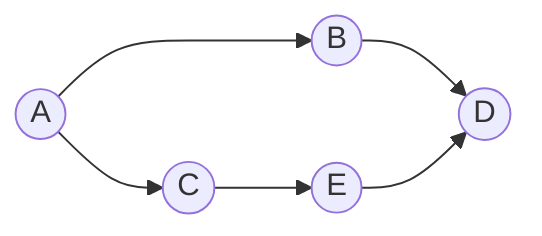

# 前趋图
一种用来描述[[进程]]之间执行的先后顺序的图.
前驱图是 **有向无循环图** , 不能出现循环, 即如下形式:

### 有关前趋图的概念

A 是 B, C 的 **直接前趋** 

B, C 是 A  的 **直接后继**

结点代表进程

结点直接的关系可以标识为:
 $A \to B$  或者 $(A, B) \in \to$
 
 **必须A执行完, 才能执行B** 
 
 A是初始结点, D是终止结点
 
 结点的重量 : 表示进程的程序量或者执行的时间
 
 可以归纳前驱图的三个要点:
 1. 结点(即进程)
 2. 结点之间的关系
 3. 结点的重量