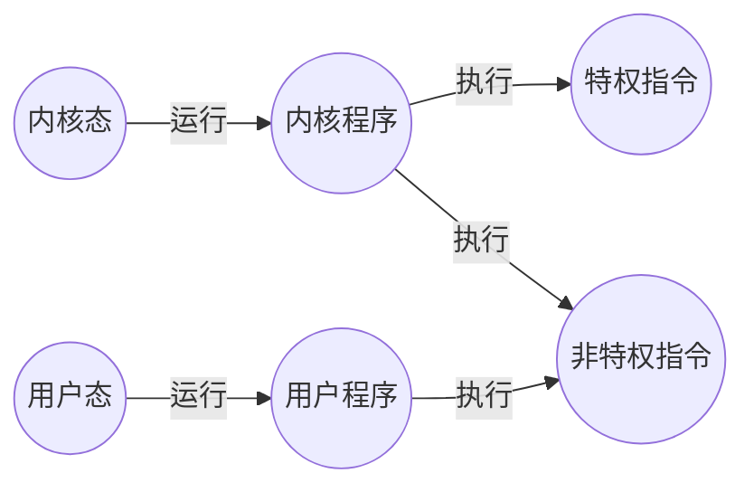

## 操作系统的运行机制

### 内核程序 vs 用户程序

内核程序: 组成操作系统的程序

用户程序: 普通程序员编写的程序

### 特权指令 vs 非特权指令
特权指令只能在内核程序中执行

非特权指令可以在用户程序中执行

CPU生产时已经划分了特权指令和非特权指令, 因此程序执行前就能判断出指令的类型

### 内核态 vs 用户态
计算机中有一个程序状态字寄存器PSW, 其中有个二进制位, 可以0/1来表示内核态/用户态

内核态中, 运行的是内核程序, 可以执行特权指令

用户态中, 运行的是用户程序, 只能执行非特权指令

内核态\=\=核心态度\=\=管态 
用户态\=\=目态

### 内核态与用户态的切换

内核态 -> 用户态 :  
内核态中执行一条特权指令, 将PSW的值修改为用户态的值, 内核让出控制权

用户态 -> 内核态: 
由[[中断与异常|中断]] 引发, **硬件自动完成变态过程**, 触发中断信号意味着内核抢占到控制权