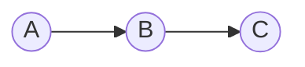
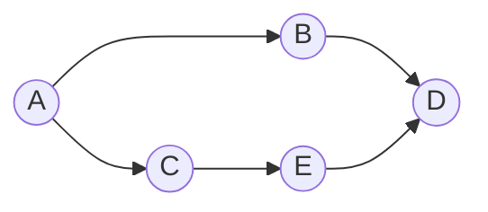

## 程序执行的方式

### 顺序执行

对于一个固定的程序, 执行的顺序是不变的

执行顺序必须是A --> B --> C , 不能改变

#### 顺序执行的特征
1. 顺序性   程序必须按照某个顺序执行, 不能改变
2. 封闭性  程序运行期间独占处理机资源, 资源的状态只有程序可以改变, 执行结果不受外部影响
3. 可再现性   外部条件一致时, 程序执行的结果可以再现

### 并发执行
程序的并发执行是指两个或以上的程序或程序段在同一时间间隔内同时执行.

不存在前趋关系的程序或程序段间可以并发执行

如图, A, C之间存在前趋关系, 因此不能并发执行

B, C之间不存在前趋关系, 因此可以并发执行

#### 并发执行的特征

1. 间断性   如图中的D, 如果B执行完后E没有执行完, 则D不能执行. 而由于D, E会争抢处理机, 当E抢占到处理机时, 程序可以继续执行; 当D抢占到处理机时, 程序会暂停. 故程序会陷入 "执行 - 暂停 - 执行" 的间歇性活动中  根本原因:程序共享系统资源.
2. 失去封闭性   资源由多个程序共享, 结果也由多个程序的执行顺序共同决定
3. 不可再现性   失去封闭性必然会导致程序的不可再现性. 因为就算外部环境一致, 程序执行的顺序不同也会导致结果不同.  