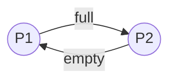

## 经典进程同步问题
### 生产者-消费者问题
> 问题: 系统中有一组生产者进程和一组消费者进程, 生产者进程每次生产一个产品放到缓冲区, 消费者进程每次从缓冲区中取走一个进程.

问题分析:

对于生产者来说, 如果缓冲区满, 则阻塞(P); 同时唤醒可能沉睡的消费者进程(V); 
对于消费者来说, 如果缓冲区空, 则阻塞(P); 同时唤醒可能沉睡的消费者进程(V);
对于缓冲区来说, 消费者和生产者都需要互斥的访问, 才能保证数据不出错.

这里以P1代表生产者进程; P2代表消费者进程



```c
semaphore full = n;        //对于生产者来说, 当前缓冲区中可用的资源数为n
semaphore empty = 0;       //对于消费者来说, 当前缓冲区可用资源数为0
semaphore mutex = 1;       //互斥访问信号量

//生产者进程
P1() {
	P(full);    //若full为空, 则阻塞; 若full不为空, 则申请一个资源, full--
	P(mutex);   //互斥的访问缓冲区
	Add to Buffer;
	V(mutex);
	V(empty);   //生产者生产产品后, empty资源量++, 同时唤醒消费者进程
}

//消费者进程
P2() {
	P(empty);    //若empty为空, 则阻塞; 否则, 消费一个资源, empty--
	P(mutex);    //互斥访问缓冲区
	Take from Buffer;
	V(mutex);
	V(full);     //消费者消费产品后, full资源量++, 同时唤醒生产者进程
}

```

在使用信号量机制实现进程同步时, 要遵守前V后P的原则, 而这个问题中, full 和 empty 资源量的前V后P实际上是分布在两个进程中的; 

当缓冲区满时, 只有消费者进程 `V(full)` 之后, 生产者进程才能 `P(full)` ;<br>而当缓冲区空时, 只有生产者进程 `V(empty)` 后, 消费者进程才能 `P(empty)` 


### 读写问题
> 一个数据文件或记录可以被多个进程进程共享. 这其中, 写进程访问文件时, 其他写进程和读进程不能访问; 读进程访问时, 其他读进程可以访问, 但写进程不能访问.

问题分析:

1. 写进程和读进程互斥的访问数据文件
2. 读进程和读进程共享的访问数据文件
3. 写进程和写进程互斥的访问数据文件

```c
/* 版本一 */
semaphore rw = 1;      //读写资源量, 当进程拥有该资源时, 可以互斥的访问资源

//写进程
writer() {
	P(rw);            //独占资源, 实现写进程的互斥访问
	write;            
	V(rw);            //释放资源
}

//读进程
reader() {
	P(rw);           //独占资源, 实现读进程的互斥访问
    read;
	V(rw);           //释放资源
}
```

上述程序实现了写进程的互斥访问, 然而读进程和读进程的共享访问却没有实现

若要实现读进程和读进程的互斥访问, 重点是读进程只需要加锁一次; 当第一个读进程访问加锁后, 后续读进程访问不加锁; 只有当最后一个读进程访问结束, 锁才能回收

```c
/*版本二*/

semaphore rw = 1;      //读写资源量, 当进程拥有该资源时, 可以互斥的访问资源
semaphore count = 0;   //读进程的数量

//写进程
writer() {
	P(rw);            //独占资源, 实现写进程的互斥访问
	write;            
	V(rw);            //释放资源
}

//读进程
reader() {
	if(count == 0) {      //只有当count == 0 , 即当前进程是第一个读进程时, 才加锁
		P(rw);           //独占资源, 实现读进程的互斥访问
	}
	count ++;
    
	read;

	count --;
	if(count == 0) {     //只有当最后一个读进程都读完了, 才释放锁
		V(rw);           //释放资源
	}
}
```

这样理论上可以实现读进程与读进程的共享访问.

然而实际上, P(rw) 和 count++ 这两步是分开的, 想象一下这个场景:

1. 第一个读进程来到时, count == 0, 该进程对资源加锁, 但是还没有执行 count++, 时间片就用完了;
2. 第二个读进程来到时, count  == 0, 该进程也申请对资源加锁, 申请不成功, 该进程阻塞;
3. 第一个读进程执行 count++, 之后读文件
4. 第二个读进程只有等所有的读进程执行完, 才能获得执行机会

综上可知, P(rw) 和 count++ 这两部分操作是不能分开的, 即执行 P(rw) 和 count ++ 时要互斥访问.

```c
/*版本三*/

semaphore rw = 1;      //读写资源量, 当进程拥有该资源时, 可以互斥的访问资源
semaphore count = 0;   //记录读进程的数量
semaphore mutex = 1;   //互斥访问资源量

//写进程
writer() {
	P(rw);            //独占资源, 实现写进程的互斥访问
	write;            
	V(rw);            //释放资源
}

//读进程
reader() {
	P(mutex);            //互斥访问
	if(count == 0) {      //只有当count == 0 , 即当前进程是第一个读进程时, 才加锁
		P(rw);           //独占资源, 实现读进程的互斥访问
	}
	count ++;
	V(mutex);
    
	read;

    P(mutex);            //互斥访问
	count --;
	if(count == 0) {     //只有当最后一个读进程都读完了, 才释放锁
		V(rw);           //释放资源
	}
	V(mutex);
}

```

该程序真正意义上实现了读进程的共享访问.

然而这个程序有可能导致写进程饥饿: 当有源源不断的读进程到来时, 写进程可能永远无法获得rw 资源量.
因此, 需要改造上述程序, 当写进程到来时, 在写进程之后到来的读进程应当阻塞.

```c
/*版本四*/

semaphore rw = 1;      //读写资源量, 当进程拥有该资源时, 可以互斥的访问资源
semaphore count = 0;   //记录读进程的数量
semaphore mutex = 1;   //互斥访问资源量
semaphore w = 1;       //阻塞后续读进程

//写进程
writer() {
	P(w);             
	P(rw);            //独占资源, 实现写进程的互斥访问
	write;            
	V(rw);            //释放资源
    V(w);
}

//读进程
reader() {
    P(w);
	P(mutex);            //互斥访问
	if(count == 0) {      //只有当count == 0 , 即当前进程是第一个读进程时, 才加锁
		P(rw);           //独占资源, 实现读进程的互斥访问
	}
	count ++;
	V(mutex);
	V(w);

	read;

    P(mutex);            //互斥访问
	count --;
	if(count == 0) {     //只有当最后一个读进程都读完了, 才释放锁
		V(rw);           //释放资源
	}
	V(mutex);
}
```

以 读-读-写-读 为例:
1. 当第一个读进程到来时, w=1, mutex=1, count=0, rw=1, 顺利加锁; 假设第一个进程未执行V(w), 时间片用完
2. 第二个读进程到来, w=0, 阻塞
3. 第一个读进程执行V(w), w释放, 并开始读文件
4. 第二个读进程到来, w=1, count = 1, 无需加锁, 执行V(w) , 然后开始读文件
5. 第一个写进程到来, w=1, rw=0, 阻塞
6. 第一个读进程执行完毕
7. 第三个读进程到来, w = 0, 阻塞
8. 第二个读进程结束, 释放rw锁
9. 写进程获取rw锁, 开始互斥写
10. 第三个读进程继续阻塞
11. 写进程结束, 释放rw锁和w锁
12. 第三个读进程开始读

这样就能保证写进程不会饥饿.

### 哲学家问题
有5个哲学家围在圆桌旁, 他们的两边各有一只筷子. 哲学家要么在思考, 要么在吃饭. 思考时放下筷子, 吃饭时必须拿到左右两边的筷子才能开始吃饭.


可以将五个筷子存入到一个数组中, 每个哲学家左边的筷子号与他相同, 右边的筷子号是(i+1)%5
则取筷子可以如下描述:
```c
int[] chopsticks = {1, 1, 1, 1, 1}  //筷子资源量

Pi() {
	P(chopsticks[i]);            //获取左边的筷子
	P(chopsticks[(i+1)%5]);      //获取右边的筷子

	V(chopsticks[i]);            //释放左边的筷子
	V(chopsticks[(i+1)%5]);      //释放右边的筷子
}
```

试想以下场景:

每个哲学家都获取了左边的筷子, 那么每个哲学家都等待右边的筷子; 死锁形成

因此哲学家拿筷子时, 必须左边右边一起拿

```c
int[] chopsticks = {1, 1, 1, 1, 1}  //筷子资源量
semaphore mutex = 1;

Pi() {
	P(mutex);                    //拿筷子时互斥访问, 保证哲学家必须同时拿筷子
	P(chopsticks[i]);            //获取左边的筷子
	P(chopsticks[(i+1)%5]);      //获取右边的筷子
	V(mutex);

	V(chopsticks[i]);
	V(chopsticks[(i+1)%5]);
	
}

```

哲学家进餐问题还有其他解法, 如奇数号的哲学家必须先拿左边的筷子, 偶数号的哲学家必须先拿右边的筷子.  这里时间不够, 不予深究. 