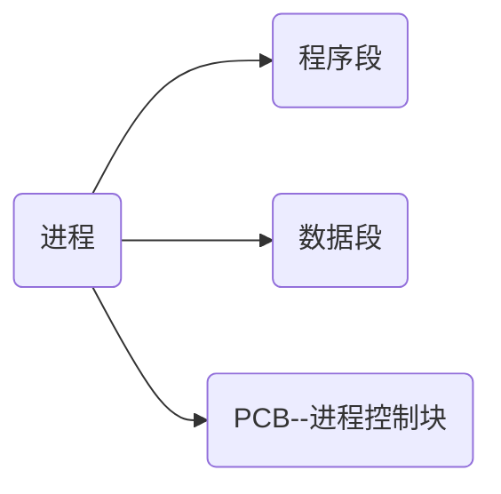
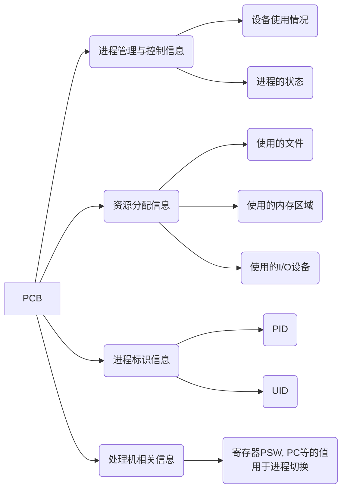

## 进程的定义
1. 典型定义
	1. 程序的 **一次** 运行
	2. 程序及其数据在处理机上一次**顺序执行**的活动
	3. 进程是具有独立功能的程序在一个数据集合上运行的过程, 是系统进行**资源分配和调度**的基本单位
2. 引入进程实体后的定义
进程是进程实体的运行过程, 是系统进行**资源分配和调度**的一个独立单位

PCB是给操作系统用的 
程序段与数据段是给进程自己用的

创建进程: 创建PCB

撤消进程: 撤消PCB

### PCB
**PCB是进程存在的唯一标识** 

PCB本质上是一个数据结构

操作系统需要记录的有关进程的信息:
1. 进程的标识:PID    进程所属的用户ID:UID  用这些信息来**区分进程**
2. 记录操作系统给进程分配的资源 操作系统利用这些信息来分配资源
3. 记录进程的运行情况 根据这些信息实现对进程的管理和调度

这些信息都存储在PCB中 
操作系统管理进程时所需要的信息都放在PCB中

