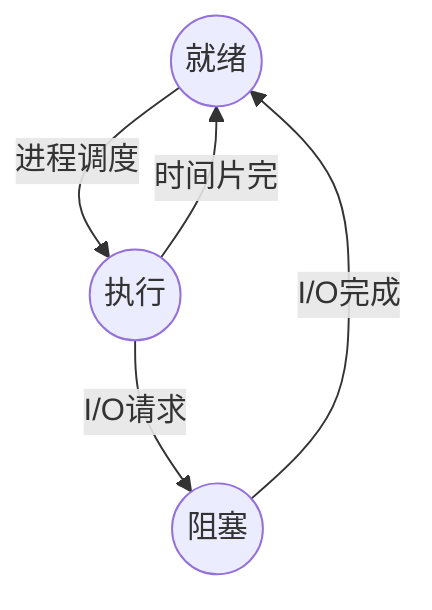
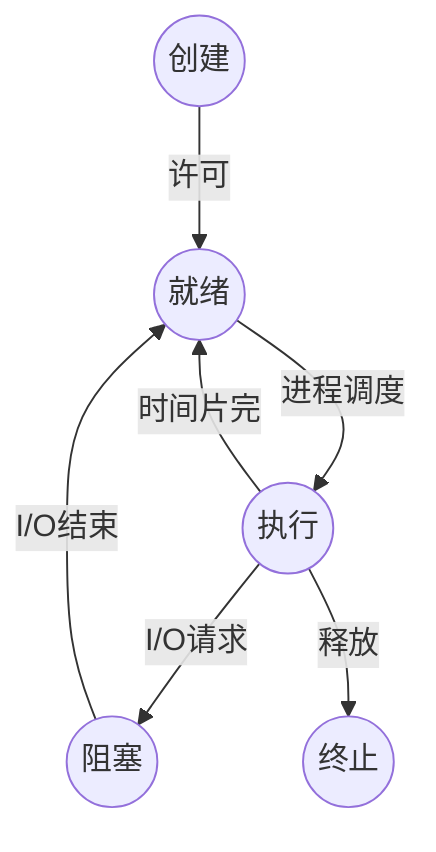
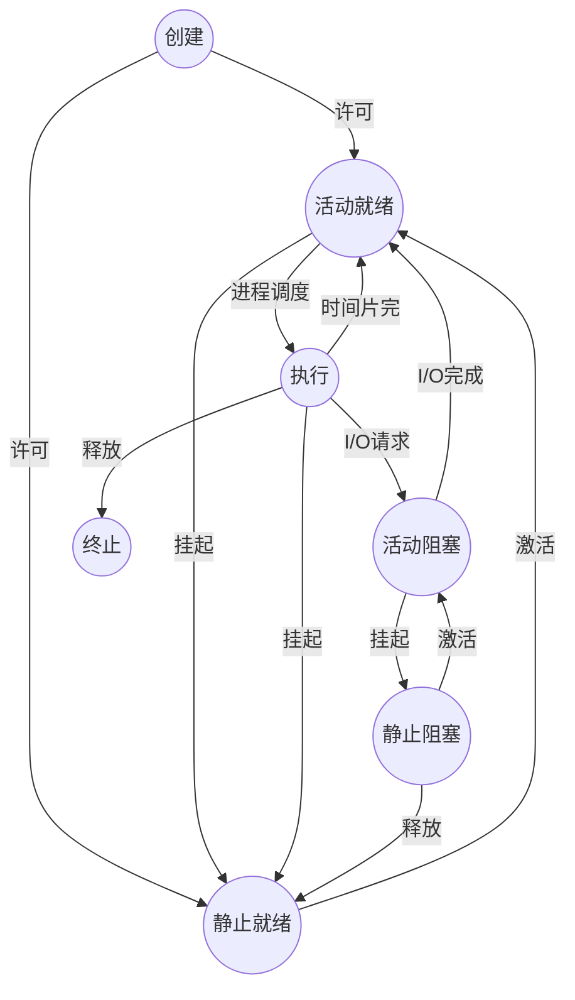
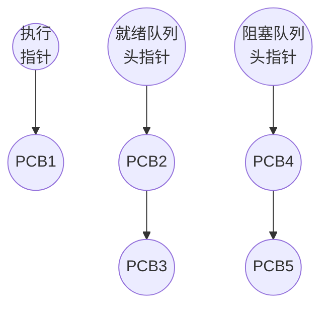

### 进程的状态

1. **就绪状态**(基础状态)   程序已经获取除CPU以外的所有资源, 一旦获取CPU就可以执行  就绪状态下的进程存在就绪队列中, 依据一定的规则等待获取CPU权限
2. **执行状态**(基础状态)   程序获得CPU后, 正在执行的状态
3. **阻塞状态**()   程序执行时, 因某些原因被阻塞(如I/O), 无法继续执行, 就会进入阻塞状态.   阻塞状态下的进制存放在阻塞队列中

基础状态下的进程状态转换:

执行态 到 阻塞态 是进程发出"[[系统调用]]"引起的, 是进程主动的行为

阻塞态 到 就绪态 是操作系统控制的, 进程无法控制

4. **创建状态**: 

进程的创建步骤: 
1. 申请空白PCB块 并向PCB块中写入控制和管理进程信息 
2.  申请进程运行所必须的资源   
3.  将进程的状态转化为就绪状态并将进程插入到就绪队列中

当步骤2或3出现问题时, 程序没有创建完成, 即 
1.未能申请到进程运行所必须的资源 
2.就绪队列已满 
则进程会停留在创建状态

引入创建状态的作用: 
保证进程必须是在创建后才被执行, 确保PCB的完整性

5. **终止状态**: 

进程终止的步骤: 
1.操作系统进行善后处理 
2.PCB清零并回收PCB空间 

进程进入终止状态的原因: 
1.进程到达自然结束点 
2.进程遇到无法克服的错误 
3.操作系统强制结束 
4.有终止权限的进程强行终止 

引入创建和终止状态后的进程状态转换:

6. 挂起与激活操作

为了方便系统和用户观察和分析进程, 引入挂起操作. 被挂起的进程被称为静止进程, 不能被CPU调用.  只有处于就绪状态和阻塞状态的进程可以被挂起 
激活操作与挂起操作相对应

为了描述挂起和激活, 将就绪状态分为 活动就绪 和 静止就绪, 
将阻塞状态分为 活动阻塞 和 静止阻塞

引入挂起和激活操作后的状态转换:

进程PCB中, 会有一个寄存器state用来保存进程的状态

### 进程的组织
为了将同一状态下的各个进程统一进行管理, 操作系统会把各个进程的PCB组织起来

#### 链接方式

#### 索引方式

